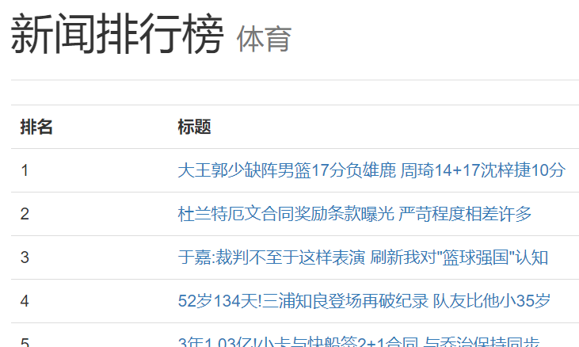

# 用户使用说明

## 1. 概述
本项目通过定时后台爬虫，每间隔若干小时爬取“网易新闻排行榜”网站新闻排行及新闻内容，存储在MySQL数据库中，在ASP.NET网站上分类显示。用户可以点选不同的类型标题进入各分类页面浏览新闻排行，并可点击新闻标题浏览新闻详细内容。

---

## 2. 开发工具
- **数据库**：MySQL 8.0
- **数据库连接器**：Pomelo.EntityFrameworkCore.MySql
- **.NET框架**：.NET Core 2.1
- **WEB框架**：ASP.NET CORE MVC
- **HTML解析器**：Html Agility Pack 1.11.8
- **测试浏览器**：Google Chrome

---

## 3. 使用说明
### 3.1. 修改配置文件
`appsettings.json`是程序的配置文件，记录了数据库及爬虫的相关配置信息。大部分的默认配置并不需要修改，***但在开始使用之前，一定要对数据库连接字符串进行配置。***

具体的配置信息包括：

#### ConnectionStrings
数据库连接字符串字典,包含若干条数据库连接字符串的配置记录，用于与数据库建立连接。

记录的形式为：`配置名: 连接字符串`如：
```
"Default": "server=localhost;user=USER;password=123456;database=newsdb;"
```
连接字符串需要根据使用者的数据库信息进行配置。

`Default`是程序中使用的配置名，使用者应继续使用，否则需要在程序代码中进行修改。

#### Interval
爬虫程序定时执行的时间间隔，值类型为`Double`(双精度浮点数)，单位为小时。

如：`"Interval" = 1.0`表示每间隔一小时执行一次爬虫程序。

#### Encoding
所要爬取网页的编码格式，值类型为`string`(字符串)。

当目标网站编码格式发生改变，或使用者将爬虫应用于其他网页时，更改此配置。

#### WebDict
所要爬取网页的字典，包括若干条网页记录。

记录形式为`类型: 网页URL`。

其中`类型`为数据库中`NewsType`字段的值，将被用于数据库查询的条件，所以需要与数据库中存储的值一致。

### 3.2. 数据库迁移
在配置好数据库连接字符串后，应用可以对数据库进行访问与修改。但在开始运行之前，需要进行数据迁移，建立对应的数据库与数据表。

在项目路径下使用此命令进行数据迁移
```
dotnet ef database update
```
建立好数据库与数据表后，需要手动添加种子数据。

### 3.3. 开始服务
完成上述工作后，你可以开始使用服务了。在项目目录下使用命令
```
dotnet run
```
服务开启，将得到类似的输出信息：
>Now listening on: https://localhost:5001
Now listening on: http://localhost:5000

在浏览器输入url进入系统web页面。

### 3.4. 网页使用


点击分区标题进入分区页面。



点击新闻标题进入详情页面。


浏览新闻详情。
